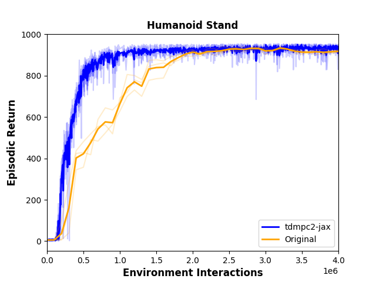
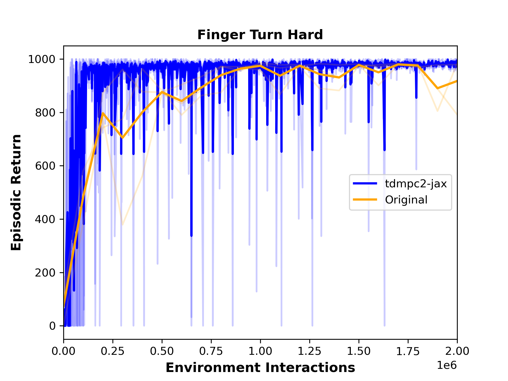
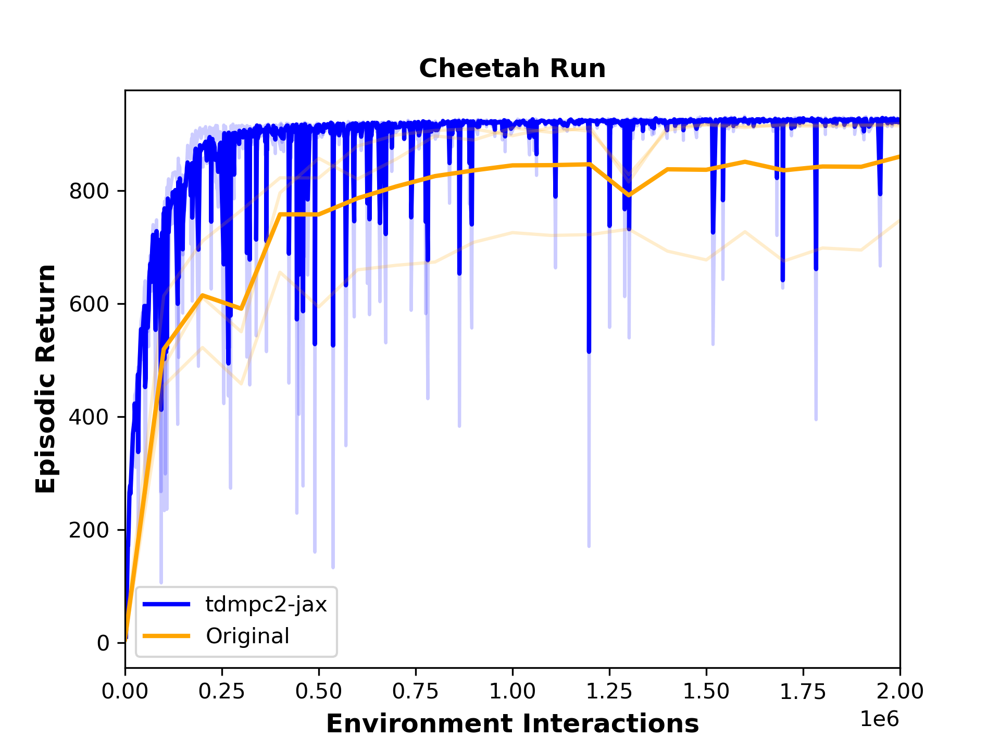
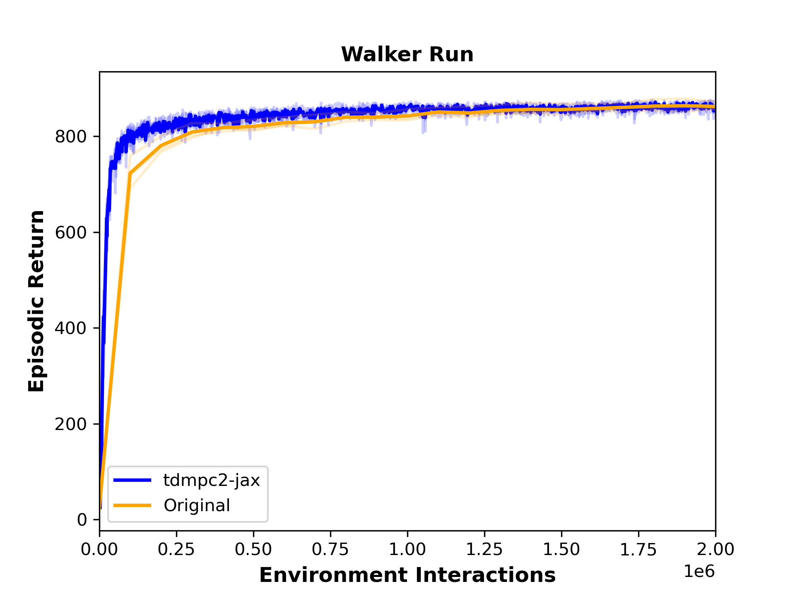

# tdmpc2-jax

A re-implementation of [TD-MPC2](https://www.tdmpc2.com/) in Jax/Flax. JIT'ing the planning/update steps makes training 5-10x faster than the original PyTorch implementation while maintaining similar or better performance in challenging continuous control environments. 

This repository also supports vectorized environments (see the env field of ```config.yaml```) and finite-horizon environments (see ```world_model.predict_continues``` and ```tdmpc.continue_coef``` in ```config.yaml```).

 
 

## Usage

To install the dependencies for this project (tested on Ubuntu 22.04), run

```[bash]
pip install --upgrade "jax[cuda12_pip]" -f https://storage.googleapis.com/jax-releases/jax_cuda_releases.html

pip install --upgrade tqdm numpy flax optax jaxtyping einops "gymnasium[mujoco]" hydra-core tensorflow orbax-checkpoint dm_control
```

Then, edit ```config.yaml``` and run ```train.py``` in the main project directory. Some examples:
```[bash]
# gymnasium 
python train.py env.backend=gymnasium env.env_id=HalfCheetah-v4 
# dmcs
python train.py env.backend=dmc env.env_id=cheetah-run   
```


## Installation

Install the package from the base directory with

```[bash]
pip install -e .
```
## Contributing

If you enjoy this project and would like to help improve it, feel free to put in an issue or pull request! 
While the core algorithm is fully implemented, the following features still need to be added:

* Multi-task operation through task embeddings and replay buffer
* General jax performance improvements
    * jax.lax.scan instaead of for loops
    * VMap parallel loss computations
